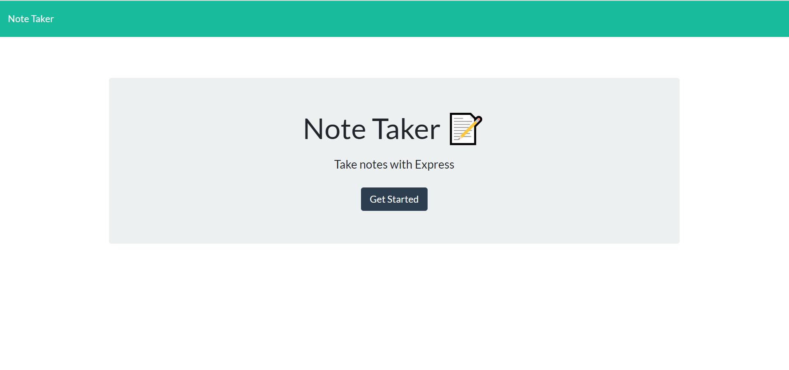
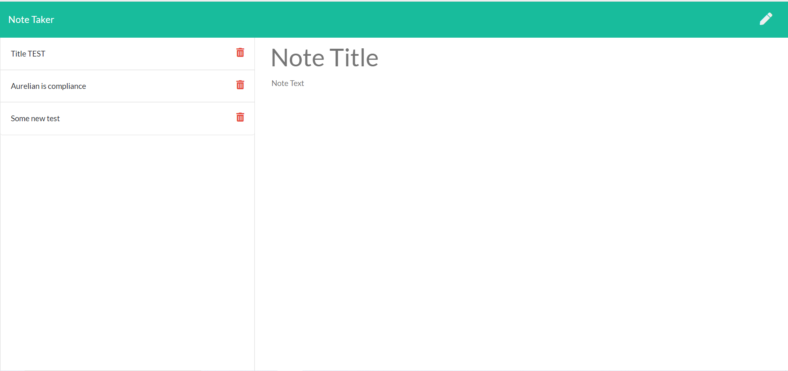

# Note-Taker

An application to take and save notes

The appication has two pages: the home page and the note page. It uses Express.js to run a server, which controls the application flow by handling api requests from the Front-End. All data is stored in the corresponding json file.

The home page has a "Get started" button. It is used to move to the second page.

The note page contains all notes taken so far on the left-hand side. In order to get all notes, the page makes corresponding api call to the server. If a user clicks on a note, the contents of the note will be shown.
If the user clicks on the "New" button, the empty note is shown, and the user can edit it. Once the user clicks "Save" button, an API call is made to save the note.
Each note has a "Delete" button which when clicked will make an API call to delete corresponding note from the json file. 

